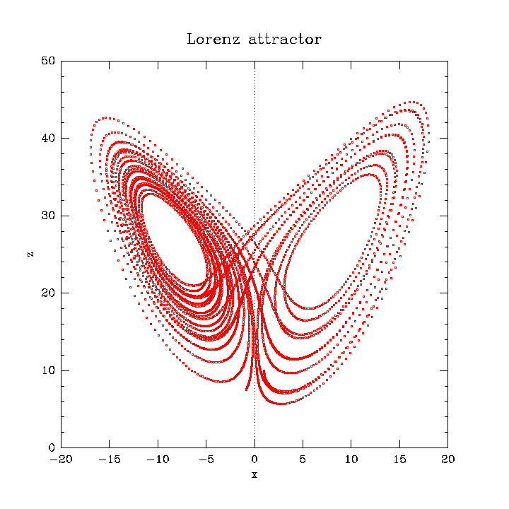

# Lorenz system

### Lorenz equations

The Lorenz attractor arises in a simplified system of equations describing the two-dimensional flow of fluid of uniform depth.

$$
\begin{align}
\dot{x} & = & \sigma (y - x) \\
\dot{y} & = & x (\rho - z) - y \\
\dot{z} & = & x y - \beta z
\end{align}
$$

The parameters $\sigma$, $\rho$, and $\beta$ are positive.

### Critical points

If $\rho < 1$ then there is only one equilibrium point $(0, 0, 0)$. For $\rho > 1$ two additional critical points appear at

$$
\begin{align}
\Big( \sqrt{\beta (\rho - 1)}, \sqrt{\beta (\rho - 1)}, \rho - 1 \Big) \\
\Big( -\sqrt{\beta (\rho - 1)}, -\sqrt{\beta (\rho - 1)}, \rho - 1 \Big)
\end{align}
$$

They are stable if

$$
\rho < \sigma \dfrac{\sigma + \beta + 3}{\sigma - \beta - 1}
\qquad
\sigma > \beta + 1
$$

### Chaotic behavior

The system exhibits chaotic behavior for values near $\sigma = 10$, $\rho = 28$, $\beta = \frac{8}{3}$.

For initial conditions $(1, 0, 0)$

