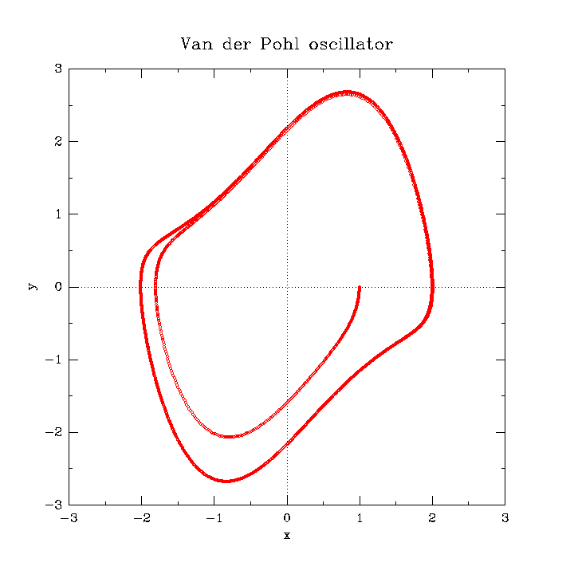

# Van der Pohl oscillator

Van der Pol's equation describes the auto-oscillations of a generator on a triode for a tube with a cubic characteristic.

$$
\ddot{x} - \mu (1 - x^2) \dot{x} + x = 0
$$

For $\mu = 1.0$ and initial conditions $(1, 0)$

